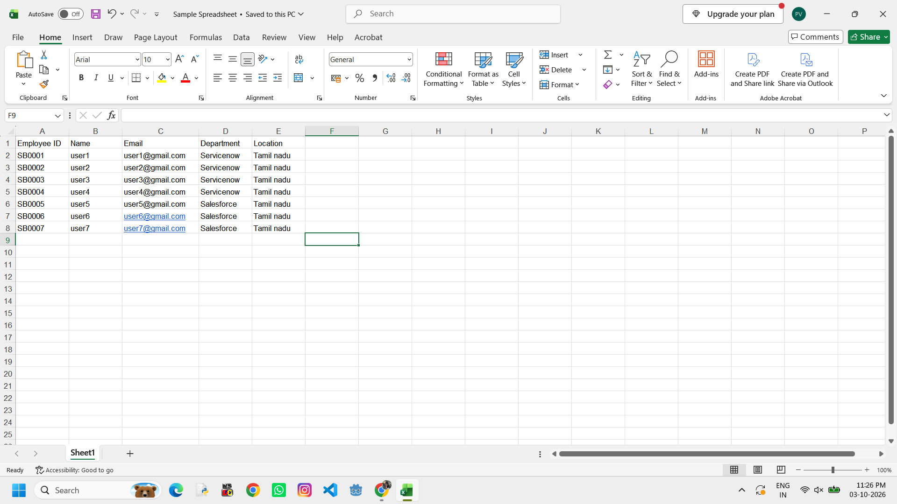
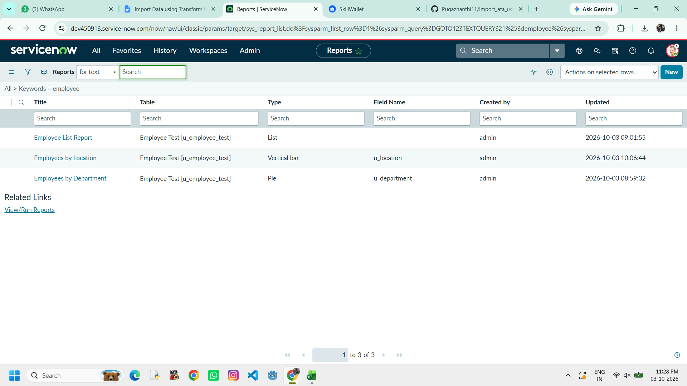
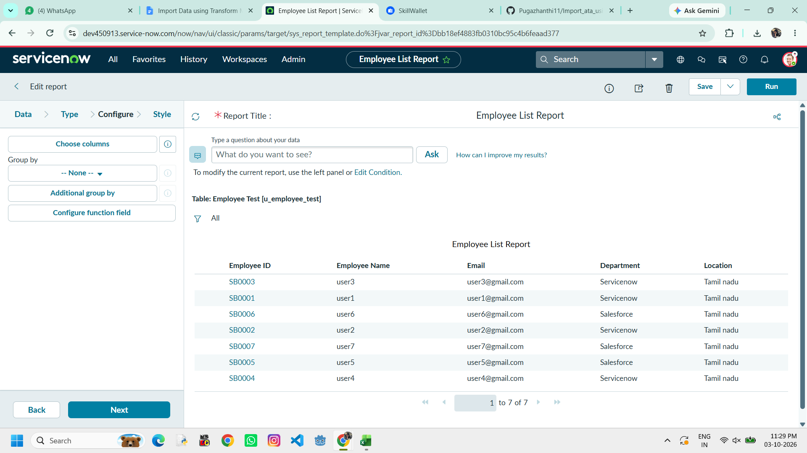
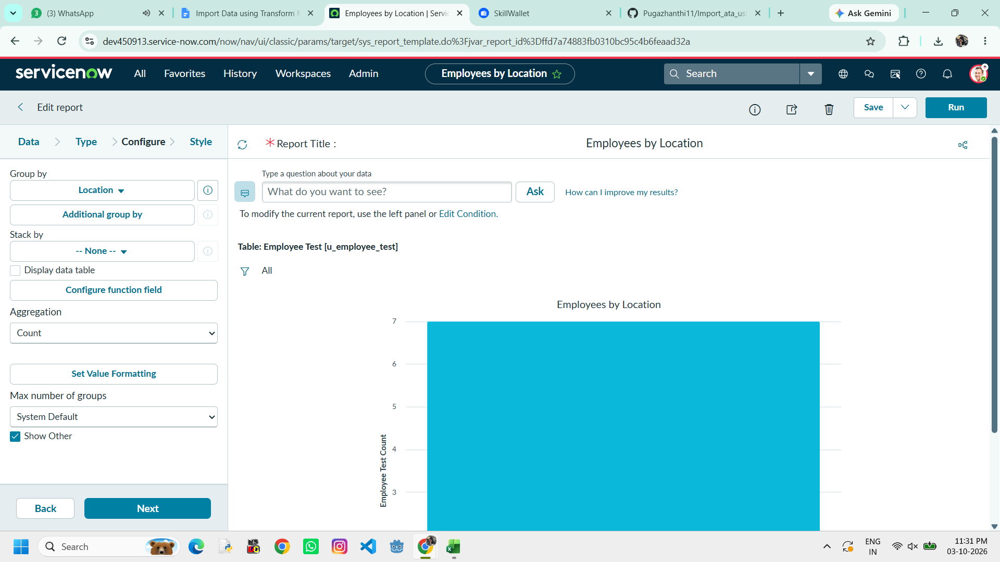
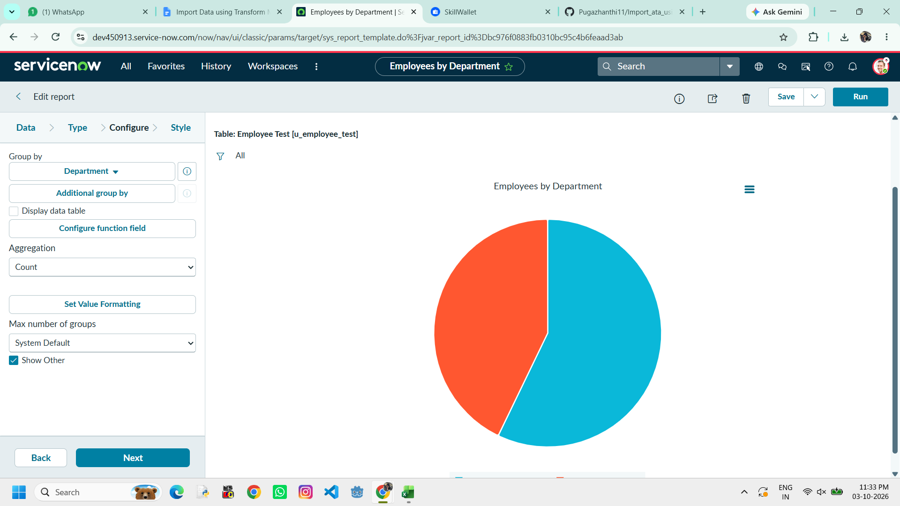

# Import Data using Transform Maps (Spreadsheet)

**Team ID:** SWTID-2026-7764  
**Project date:** 30 September 2026  
**Platform:** ServiceNow  
**Project area:** Spreadsheet import, data quality, and reporting

## Demo

[Watch the project demonstration video](https://drive.google.com/file/d/1z4COzqOmEL1DTo27pBcwj7iKN5Q8OqR9/view?usp=drive_link)

## Project team

| Name | Role |
| --- | --- |
| Thamothara N | Member |
| Silambarasan M | Member |
| Santhosh Kumar V | Member |
| Sivaranjan M | Member |
| Pugazhanthi V K | Team Lead |

## Project overview

This project demonstrates a repeatable employee-data import from an Excel workbook into ServiceNow. The workbook is loaded into the **Employee Import** Import Set table, transformed by **Sample Spreadsheet Import**, and written to **Employee Test**. Employee ID is the coalesce key, so matching records can be updated and repeated unchanged rows can be ignored instead of duplicated.

The target table includes five String fields: **Employee ID**, **Employee Name**, **Email**, **Department**, and **Location**. The workbook headers are **Employee ID**, **Name**, **Email**, **Department**, and **Location**. During transformation, **Name** maps to **Employee Name**; the other four columns map to their same-named target fields.

## Import workflow

```text
Sample Spreadsheet.xlsx
        ↓
Employee Import (u_employee_import)
        ↓
Sample Spreadsheet Import Transform Map
  Name → Employee Name
  Employee ID → Employee ID (Coalesce)
  Email, Department, Location → same-named fields
        ↓
Employee Test (u_employee_test)
        ↓
Employee List Report · Employees by Location · Employees by Department
        ↓
Employee Analytics Dashboard
```

### Configuration summary

| Component | Project configuration |
| --- | --- |
| Source workbook | `Sample Spreadsheet.xlsx`, sheet 1, header row 1 |
| Source headers | Employee ID, Name, Email, Department, Location |
| Import Set | Employee Import (`u_employee_import`) |
| Transform Map | Sample Spreadsheet Import |
| Target table | Employee Test (`u_employee_test`) |
| Field mapping | Employee ID → Employee ID; Name → Employee Name; Email → Email; Department → Department; Location → Location |
| Duplicate handling | Employee ID field map has Coalesce enabled |
| Reports | Employee List Report; Employees by Location (Bar/Count); Employees by Department (Pie/Count) |
| Dashboard | Employee Analytics Dashboard |

## Observed walkthrough results

The supplied ServiceNow walkthrough records a four-row transformation with **2 inserts**, **2 updates**, **0 ignored rows**, and **0 errors**. A repeat submission of the same four-row file records **0 inserts**, **0 updates**, **4 ignored rows**, and **0 errors**. These are the results shown in the walkthrough evidence.

The supplied Skill Wallet snapshot shows **50% overall progress** and **50% for Milestone 1**, with a 40-minute duration and two stories. Progress for the remaining milestones, formal UAT signatures, and measured performance timings were not provided in the project materials.

## Project screenshots

The following images are the supplied project screenshots. Each image is also available in the [`Screenshots`](Screenshots/) folder.

### Source employee workbook



### ServiceNow report inventory



### Employee List Report



### Employees by Location



### Employees by Department



## Documentation package

The package follows the project phases. Word documents are editable source files; paired PDFs are provided for review and submission.

### 1. Ideation

- [Brainstorming and Prioritization](1.%20Ideation%20Phase/Brainstorming%20and%20Prioritization.docx) · [PDF](1.%20Ideation%20Phase/Brainstorming%20and%20Prioritization.pdf)
- [Define Problem Statement](1.%20Ideation%20Phase/Define%20Problem%20Statement.docx) · [PDF](1.%20Ideation%20Phase/Define%20Problem%20Statement.pdf)
- [Empathy Map Canvas](1.%20Ideation%20Phase/Empathy%20Map%20Canvas.docx) · [PDF](1.%20Ideation%20Phase/Empathy%20Map%20Canvas.pdf)

### 2. Requirement analysis

- [Data Flow Diagrams and User Stories](2.%20Requirement%20Analysis/Data%20Flow%20Diagrams%20and%20User%20Stories.docx) · [PDF](2.%20Requirement%20Analysis/Data%20Flow%20Diagrams%20and%20User%20Stories.pdf)
- [Solution Requirements](2.%20Requirement%20Analysis/Solution%20Requirements.docx) · [PDF](2.%20Requirement%20Analysis/Solution%20Requirements.pdf)
- [Technology Stack and Architecture](2.%20Requirement%20Analysis/Technology%20Stack%20and%20Architecture.docx) · [PDF](2.%20Requirement%20Analysis/Technology%20Stack%20and%20Architecture.pdf)
- [Employee Data Import Journey Map](2.%20Requirement%20Analysis/Employee%20Data%20Import%20Journey%20Map.pdf)

### 3. Project design

- [Problem Solution Fit](3.%20Project%20Design%20Phase/Problem%20Solution%20Fit/Problem%20Solution%20Fit.docx) · [PDF](3.%20Project%20Design%20Phase/Problem%20Solution%20Fit/Problem%20Solution%20Fit.pdf) · [Summary PDF](3.%20Project%20Design%20Phase/Problem%20Solution%20Fit/Problem%20Solution%20Fit%20Summary.pdf)
- [Proposed Solution](3.%20Project%20Design%20Phase/Proposed%20Solution/Proposed%20Solution.docx) · [PDF](3.%20Project%20Design%20Phase/Proposed%20Solution/Proposed%20Solution.pdf)
- [Solution Architecture](3.%20Project%20Design%20Phase/Solution%20Architecture/Solution%20Architecture.docx) · [PDF](3.%20Project%20Design%20Phase/Solution%20Architecture/Solution%20Architecture.pdf)

### 4. Project planning

- [Project Planning and Milestones](4.%20Project%20Planning%20Phase/Project%20Planning%20and%20Milestones.docx) · [PDF](4.%20Project%20Planning%20Phase/Project%20Planning%20and%20Milestones.pdf)
- [Project Planning Logic](4.%20Project%20Planning%20Phase/Project%20Planning%20Logic.docx) · [PDF](4.%20Project%20Planning%20Phase/Project%20Planning%20Logic.pdf)

### 5. Development and validation

- [Data Import Configuration Evidence](5.%20Project%20Development%20Phase/Validation%20and%20Testing/Data%20Import%20Configuration%20Evidence.docx) · [PDF](5.%20Project%20Development%20Phase/Validation%20and%20Testing/Data%20Import%20Configuration%20Evidence.pdf)
- [Data Quality and Coalesce Evidence](5.%20Project%20Development%20Phase/Validation%20and%20Testing/Data%20Quality%20and%20Coalesce%20Evidence.docx) · [PDF](5.%20Project%20Development%20Phase/Validation%20and%20Testing/Data%20Quality%20and%20Coalesce%20Evidence.pdf)
- [Import Workflow Evidence](5.%20Project%20Development%20Phase/Validation%20and%20Testing/Import%20Workflow%20Evidence.docx) · [PDF](5.%20Project%20Development%20Phase/Validation%20and%20Testing/Import%20Workflow%20Evidence.pdf)
- [Reports and Dashboard Validation](5.%20Project%20Development%20Phase/Validation%20and%20Testing/Reports%20and%20Dashboard%20Validation.docx) · [PDF](5.%20Project%20Development%20Phase/Validation%20and%20Testing/Reports%20and%20Dashboard%20Validation.pdf)
- [Reporting Performance Evidence](5.%20Project%20Development%20Phase/Validation%20and%20Testing/Reporting%20Performance%20Evidence.docx) · [PDF](5.%20Project%20Development%20Phase/Validation%20and%20Testing/Reporting%20Performance%20Evidence.pdf)
- [Functional and Performance Test Plan](5.%20Project%20Development%20Phase/Validation%20and%20Testing/Functional%20and%20Performance%20Test%20Plan.docx) · [PDF](5.%20Project%20Development%20Phase/Validation%20and%20Testing/Functional%20and%20Performance%20Test%20Plan.pdf)
- [User Acceptance Testing](5.%20Project%20Development%20Phase/User%20Acceptance%20Testing/User%20Acceptance%20Testing.docx) · [Report PDF](5.%20Project%20Development%20Phase/User%20Acceptance%20Testing/User%20Acceptance%20Testing%20Report.pdf)

### 6. Project documentation

- [Functional Specification Document](6.%20Project%20Documentation/Functional%20Specification%20Document.docx) · [PDF](6.%20Project%20Documentation/Functional%20Specification%20Document.pdf)
- [Final Project Report](6.%20Project%20Documentation/Final%20Project%20Report.pdf)
